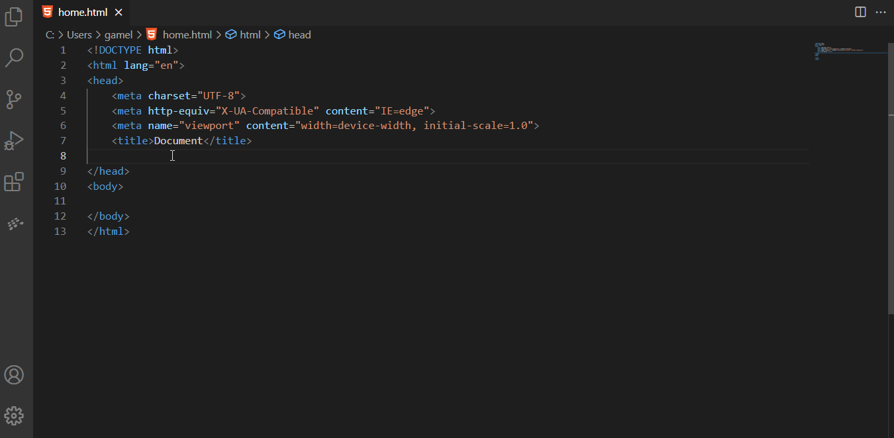

# funnee snippets for VS Code

**demo pre release**

This extension for Visual Studio Code adds snippets for funnee for TypeScript and HTML.

## funnee Essentials

to create account at - [funnelll](https://www.funnelll.com).

## Usage

Type part of a snippet, press `enter`, and the snippet unfolds.

Alternatively, press `Ctrl`+`Space` (Windows, Linux) or `Cmd`+`Space` (macOS) to activate snippets from within the editor.

### html Snippets

| Snippet  | Purpose                          |
| -------- | -------------------------------- |
| `funnee` | add funnee analytics tag         |
| `conv`   | add goog conversion tracking tag |

## Credits

this work was done as a POC from:

- [ibrahim gamil](https://www.linkedin.com/in/ibrahim-gamil-427a5010b/)
